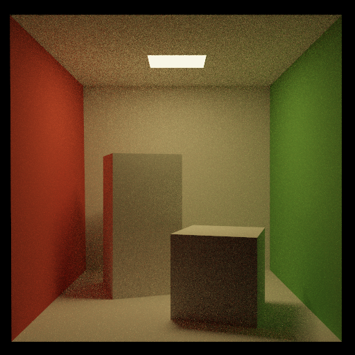
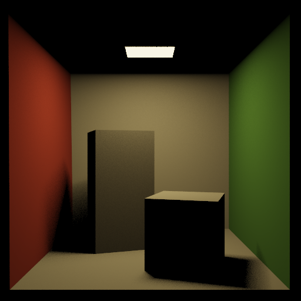
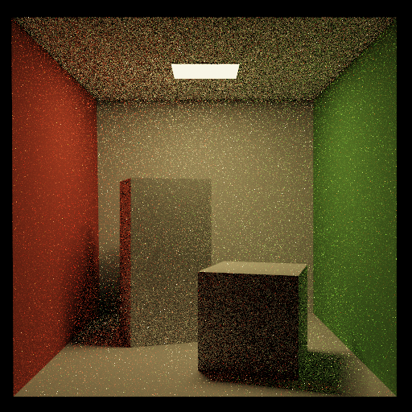
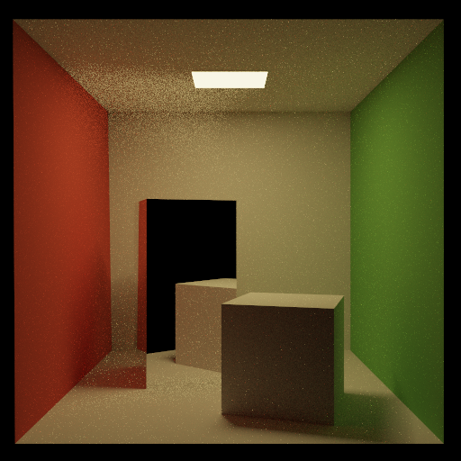
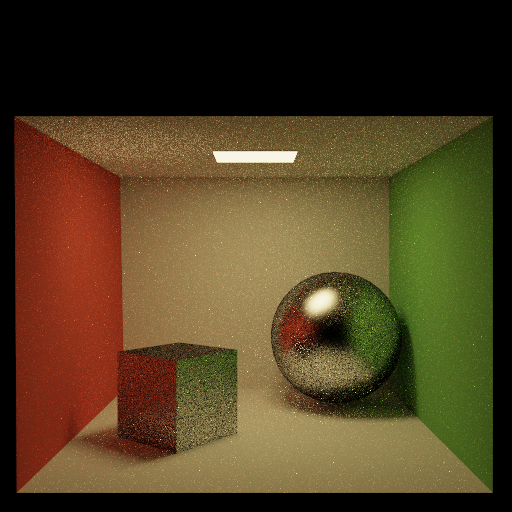
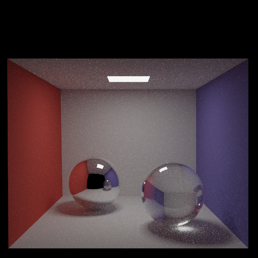

## Path (final submission)

### Design Choices
 I implemented all the brdfs, direct lighting, etc. The biggest thing I was trying to think about while designing the code was to avoid repeating calculations when it's not necessary. For example, the reflected ray should never be calculated more than one time, so I stored it into a variable called perf_refl [here](/pathtracer.cpp#L94) if we are dealing with a mirror or glossy brdf. I do not store it if we are dealing with a refractive surface, because we don't know whether or not we will be dealing with a perfect reflection. Furthermore, the reflection could be coming from the inside of the sphere, in which case we woulnd't reflect over the normal but the normal * -1. I also implemented many helper functions. I have [reflected](pathtracer.cpp#L286) and [refracted](pathtracer.cpp#L266) ray function which do the vector math necessary to get their respective directions. I also have a [get_brdf()](pathtracer.cpp#L251) function which takes in the diffuse, specular, perfect reflection direction, etc. and then determined whether to use specular or diffuse based on the terms. The perfect reflection is pre calculated and stored so as to save run time when calculating the brdf.

### Output 
Run the program with the specified `.ini` config file to compare your output against the reference images.

| `.ini` File To Produce Output | Output |
| :---------------------------------------: | :--------------------------------------------------: | :-------------------------------------------------: |
| cornell_box_full_lighting.ini |  |
| cornell_box_direct_lighting_only.ini |  |
| cornell_box_full_lighting_low_probability.ini |  |
| mirror.ini |  |
| glossy.ini |  |
| refraction.ini  |  |

