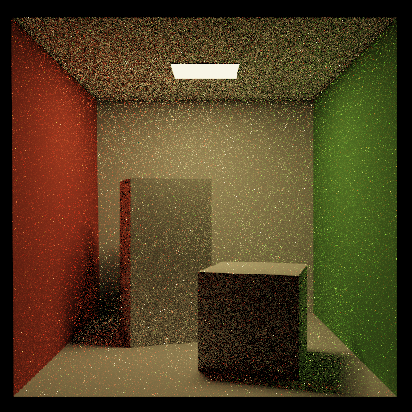
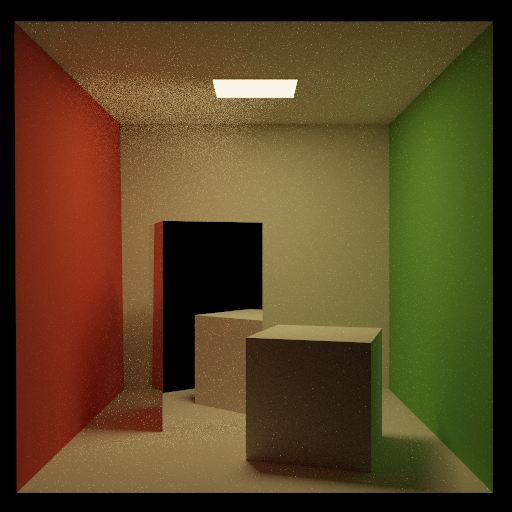
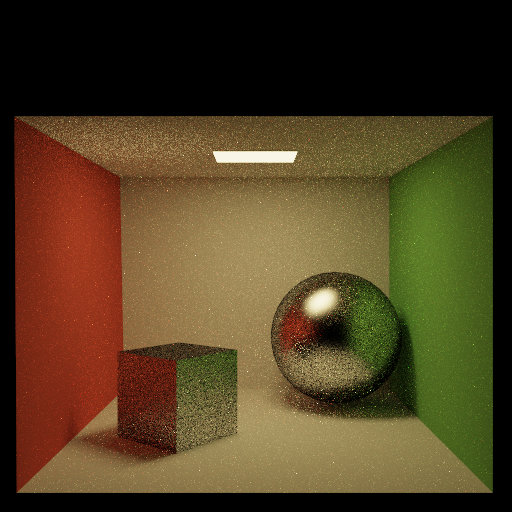

## Path (final submission)

Please fill this out and submit your work to Gradescope by the deadline.

### Output Comparison
Run the program with the specified `.ini` config file to compare your output against the reference images. The program should automatically save to the correct path for the images to appear in the table below.

If you are not using the Qt framework, you may also produce your outputs otherwise so long as you place them in the correct directories as specified in the table. In this case, please also describe how your code can be run to reproduce your outputs

> Qt Creator users: If your program can't find certain files or you aren't seeing your output images appear, make sure to: 
> 1. Set your working directory to the project directory
> 2. Set the command-line argument in Qt Creator to `template_inis/final/<ini_file_name>.ini`

Note that your outputs do **not** need to exactly match the reference outputs. There are several factors that may result in minor differences, such as your choice of tone mapping and randomness.

Please do not attempt to duplicate the given reference images; we have tools to detect this.

| `.ini` File To Produce Output | Expected Output | Your Output |
| :---------------------------------------: | :--------------------------------------------------: | :-------------------------------------------------: |
| cornell_box_full_lighting.ini |   |  |
| cornell_box_direct_lighting_only.ini |   |  |
| cornell_box_full_lighting_low_probability.ini |   |  |
| mirror.ini |   |  |
| glossy.ini |   |  |
| refraction.ini |   |  |

> Note: The reference images above were produced using the [Extended Reinhard](https://64.github.io/tonemapping/#extended-reinhard) tone mapping function with minor gamma correction. You may choose to use another mapping function or omit gamma correction.

### Design Choices
Please list all the features your path tracer implements.
Unfortunately, I did not have time to implement any of the extra features for this assignment but I have all the required ones. I implemented all the brdfs, direct lighting, etc. The biggest thing I was trying to think about while designing the code was to avoid repeaitng calculations when it's not necessary. For example, the reflected ray should never be calculated more than one time, so I store into a variable called perf_refl if we are dealing with a mirror or glossy brdf. I do not store it if we are dealing with a refractive surface, because we don't know whether or not we will be dealing with a perfect reflection. Furthermore, the reflection could be coming from the inside of the sphere, in which case we woulnd't reflect over the normal but the normal * -1. I also implemented many helper function. I have reflected and refracted ray function which do the vector math necessary to get their respective directions. I also have a get_brdf() function which takes in the diffuse, specular, perfect reflection direction, etc. and then determined whether to use specular or diffuse based on the terms. The perfect reflection is pre calculated and stored so as to save run time when calculating the brdf.

For direct lighting, I loop through some functionality numDirectLightingSamples/2 times. I divide it by 2 because within that for loop, loop through each triangle in getEmissives(). I know that there are two triangles in the cornell box scene that are emissive so by doing this I can randomly sample a point on both triangles numDirectLightinSamples/2 times which results in a total of numDirectLightingSamples samples. Once I sample a point I shoot a ray towards it and check to make sure it doesn't intersect with a different triangle before calculating the emission from the light.

### Extra Features 
Briefly explain your implementation of any extra features, provide output images, and describe what each image demonstrates.
Unfortunalety I did not have time to implement any extra features.

### Collaboration/References
Mostly conceptual questions that I asked at TA hours. Walking through problems on white boards helped alot.

### Known Bugs
I don't think this is a bug but all my images are brighter than the expected outputs. I believe that's because I implemented simple reinhard rather than extended. Besides that I do not have any bugs that I've noticed.
